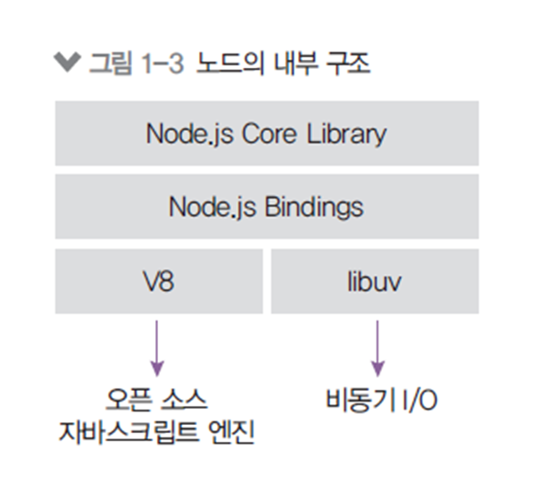
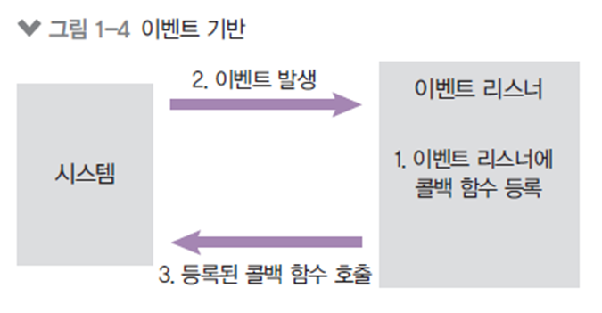
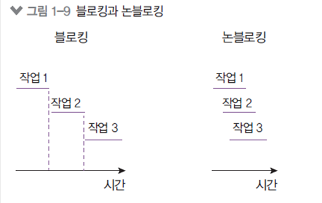
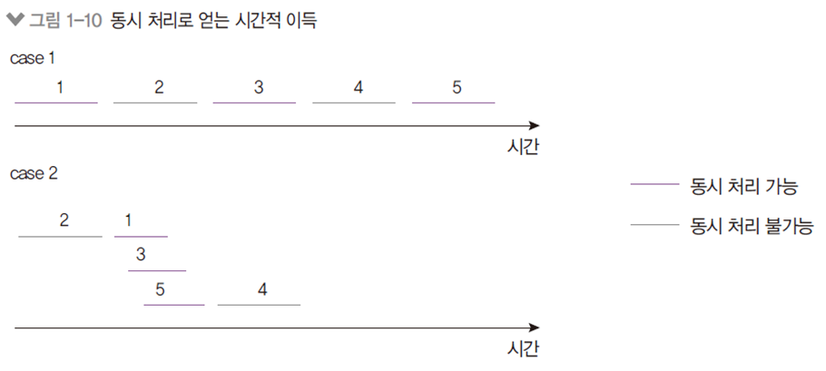
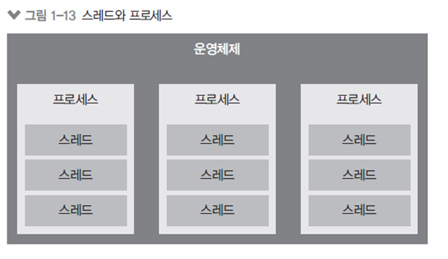
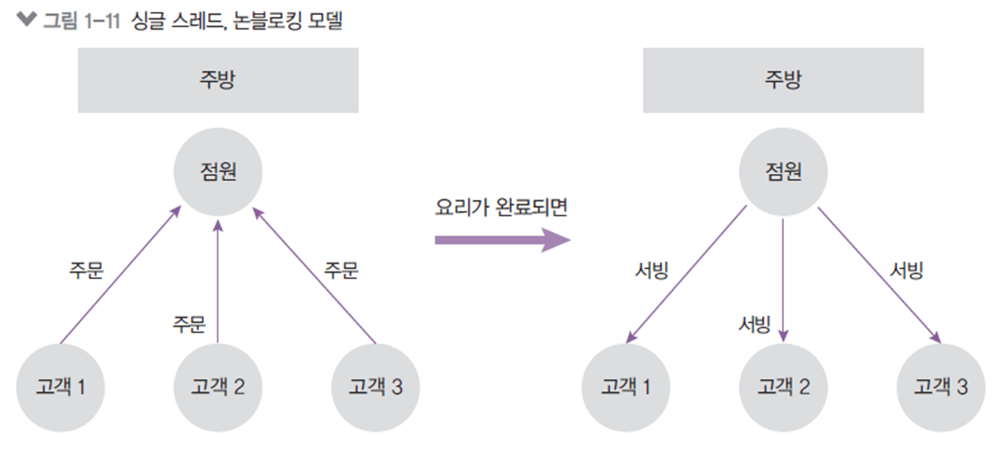
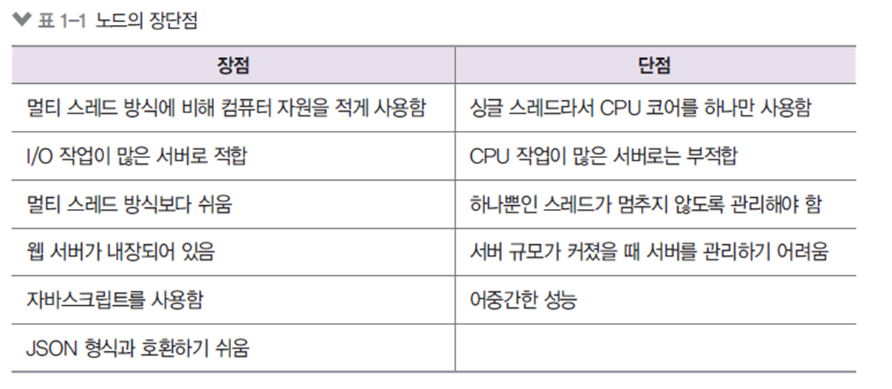

## 1. 1 노드의 정의

### 공식 홈페이지의 설명

- Node.js는 크롬 V8 자바스크립트 엔진으로 빌드된 자바스크립트 런타임입니다
- 예전에는 html이 없으면 js를 못 읽었다.
- node로 인해 js는 html이나 브라우저에 종속성에서 벗어남
- 이로 인해 자바스크립트가 데스크탑앱, 앱도 만들고, 게임도 만들게 됨

### 노드는 서버가 아닌가?

- 서버의 역할도 수행할 수 있는 자바스크립트 런타임
- 노드로 자바스크립트로 작성된 서버를 실행할 수 있음.
- 서버 실행을 위해 필요한 http/https/http2 모듈을 제공

### 노드: 자바스크립트 런타임

- 런타임 : 특정 언어로 만든 프로그램들을 실행할 수 있게 해주는 가상 머신(크롬의 V8 엔진 사용)의 상태
- 노드 : 자바스크립트로 만든 프로그램들을 실행할 수 있게 해 줌
- 다른 런타임으로는 웹 브라우저(크롬, 엣지, 사파리, 파이어폭스 등)가 있음
- 노드 이전에도 자바스크립트 런타임을 만들기 위한 많은 시도
- but, 엔진 속도 문제로 실패

### 내부 구조

- 2008 v8 엔진 출시, 2009년 노드 프로젝트 시작
- 노드는 V8과 libuv를 내부적으로 포함
  - V8 엔진 : 오픈 소스 자바스크립트 엔진 -> 속도 문제 개선
  - libuv : 노드의 특성인 이벤트 기반, 논블로킹 I/O 모델을 구현한 라이브러리
  - 

## 1.2 노드의 특성

### 이벤트 기반

- 이벤트가 발생할 때 미리 지정해둔 작업을 수행하는 방식
  - 이벤트의 예 : 클릭, 네트워크 요청, 타이머 등
  - 이벤트 리스너 : 이벤트를 등록하는 함수
  - 콜백 함수 : 이벤트가 발생했을 때 실행될 함수
- 

### 논블로킹 I/O

- 오래 걸리는 함수를 백그라운드로 보내서 다음 코드가 먼저 실행되게 하고, 나중에 오래 걸리는 함수를 실행
  - 논 블로킹 방식 하에서 일부 코드는 백그라운드에서 병렬로 실행됨
  - 일부 코드 : I/O 작업(파일 시스템 접근, 네트워크 요청), 압축, 암호화 등
  - 나머지 코드는 블로킹 방식으로 실행됨
  - I/O 작업이 많을 때 노드 활용성이 극대화
- 동기면 코드가 순서대로, 비동기면 코드가 순서대로 실행되지 않는다.
- 
- 

### 프로세스 vs 스레드

- 프로세스와 스레드
  - 프로세스: 운영체제에서 할당하는 작업의 단위, 프로세스 간 자원 공유 X
  - 스레드: 프로세스 내에서 실행되는 작업의 단위, 부모 프로세스 자원 공유
- **노드 프로세스는 멀티 스레드이지만 직접 다룰 수 있는 스레드는 하나이기 때문에 싱글 스레드라고 표현**
- **노드**는 주로 멀티 스레드 대신 **멀티 프로세스 활용**
- 노드는 14버전부터 멀티 스레드 사용 가능
- 멀티 스레드가 좋지만, 사람이 이해하기가 어려워 코딩이 어려움 그래서 직접 다룰 수 있는 스레드는 하나로 노드는 정했음(14버전 부터는 멀티 스레드 가능)
- 

### 싱글 스레드

- 싱글 스레드라 주어진 일을 하나밖에 처리하지 못함
  - 블로킹이 발생하는 경우 나머지 작업은 모두 대기해야 함 -> 비효율 발생
- 주방에 비유(점원: 스레드, 주문: 요청, 서빙: 응답)
- 
- 대신 논 블로킹 모델을 채택하여 일부 코드(I/O)를 백그라운드(다른 프로세스)에서 실행가능
  - 요청을 먼저 받고, 완료될 때 응답함
  - I/O 관련 코드가 아닌 경우 싱글 스레드, 블로킹 모델과 같아짐
  - 

### 멀티 스레드 모델과의 비교

- 싱글 스레드 모델은 에러를 처리하지 못하는 경우 멈춤
  - 프로그래밍 난이도 쉽고, CPU, 메모리 자원 적게 사용
- 멀티 스레드 모델은 에러 발생 시 새로운 스레드를 생성하여 극복
  - 단, 새로운 스레드 생성이나 놀고 있는 스레드 처리에 비용 발생
  - 프로그래밍 난이도 상승
  - 스레드 수만큼 자원을 많이 사용함
- 점원: 스레드, 주문: 요청, 서빙: 응답
  - 

### 멀티 스레드의 활용

- 노드 14 버전
  - 멀티 스레드를 사용할 수 있도록 worker_threads 모듈 도입
  - CPU를 많이 사용하는 작업인 경우 활용 가능
  - **멀티 프로세싱만 가능했던 아쉬움을 달래줌**(주는 아님)
- 

## 1.3 노드의 역할

### 서버로서의 노드

- 서버 : 네트워크를 통해 클라이언트에 정보나 서비스를 제공하는 컴퓨터 또는 프로그램
- 클라이언트: 서버에 요청을 보내느 주체(브라우저, 데스크탑 프로그램, 모바일 앱, 다른 서버에 요청을 보내는 서버)
- 예시
  - 브라우저(클라이언트, 요청)가 길벗 웹사이트(서버, 응답)에 접속
  - 핸드폰(클라이언트)을 통해 앱스토어(서버)에서 앱 다운로드
- 노드 != 서버
- But, 노드는 서버를 구성할수 있게 하는 모듈(4장에서 설명)을 제공
- 

### 노드 서버의 장단점

- 
- CPU 작업을 위해 AWS Lambda나 Google Cloud Functions 같은 별도 서비스 사용
- 페이팔, 넷플릭스, 월마트, 링크드인, 우버 등에서 메인 또는 서브 서버로 사용

### 서버 외의 노드

- 자바스크립트 런타임이기 때문에 용도가 서버에만 한정되지 않음

- 웹, 모바일, 데스크탑 애플리케이션에도 사용

  - 웹 프레임워크: Angular, React, Vue, Moteor 등
  - 모바일 앱 프레임워크 : React Native
  - 데스크탑 개발 도구: Electron(Atom, Slack, VSCode, Discord 등 제작)

- 위 프레임워크가 노드 기반으로 동작함

- 

  

