# 2

### 2.1 호출 스택, 이벤트 루프

```javascript
function first() {
    second();
    console.log('첫 번째');
}

function second() {
    third();
    console.log('두 번째');
}

function third() {
    console.log('세 번째')
}
first();
```

- 3 -> 2 -> 1
- 쉽게 파악하는 방법: 호출 스택 그리기

- 
- 호출 스택(함수의 호출, 자료구조의 스택)
  - Anonymous은 가상의 전역 컨텍스트(항상 있다고 생각하는 게 좋음)
  - 함수 호출 순서대로 쌓이고, 역순으로 실행됨
  - 함수 실행이 완료되면 스택에서 빠짐
  - LIFO 구조라서 스택이라고 불림

```javascript
function run() {
    console.log('3초 후 실행');
}
console.log('시작')
setTimeout(run, 3000);
console.log('끝');
```

- 시작 -> 끝 -> 3초 후 실행
- 호출 스택만으로는 설명이 안 됨(run은 호출 안됐는데?)
- 호출 스택 + 이벤트 루프로 설명할 수 있음


- 이벤트루프 구조
  - 이벤트 루프: 이벤트 발생(setTimeout 등) 시 호출할 콜백 함수들(위의 예제에서는 run)을 관리하고, 호출할 순서를 결정하는 역할
  - 태스크 큐 : 이벤트 발생 후 호출되어야 할 콜백 함수들이 순서대로 기다리는 공간
  - 백그라운드 : 타이머나 I/O 작업 콜백, 이벤트 리스너들이 대기하는 공간, 여러 작업이 동시에 실행될 수 있음

### 2.2 ES2015+

- ES2015 이전에는 var로 변수를 선언

  - ES2015부터는 const와 let이 대체
  - 가장 큰 차이점 : 블록 스코프(var은 함수 스코프)

  ```javascript
  if (true) {
      var x = 3;
  }
  console.log(x); // 3
  
  if (true) {
      const y = 3;
  }
  console.log(y); // Uncaught ReferenceError: y in not defined
  ```

- 기존: 함수 스코프(function() {}이 스코프의 기준점)

  - 다른 언어와는 달리 if나 for, while은 영향을 미치지 못함
  - const와 let은 함수 및 블록({})에도 별도의 스코프를 가짐

### **const, let**

- const는 상수
  - 상수에 할당한 값은 다른 값으로 변경 불가
  - 변경하고자 할 때는 let으로 변수 선언
  - 상수 선언 시부터 초기화 필요
  - 초기화를 하지 않고 선언하면 에러

### **백틱**

- 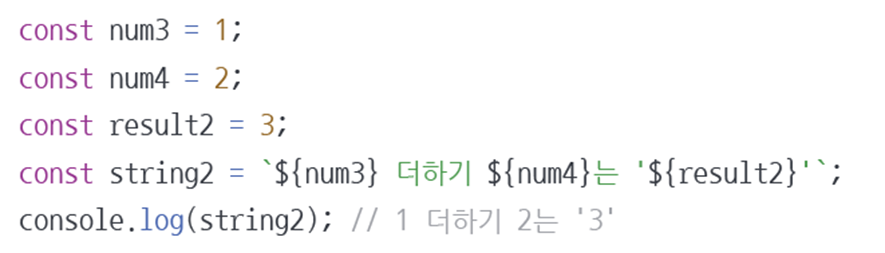

### **객체리터럴**

- es5
  - 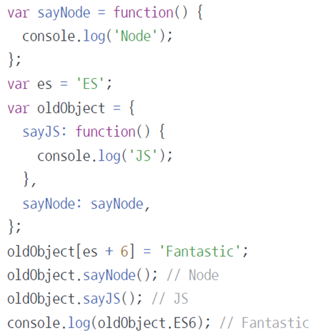
  - 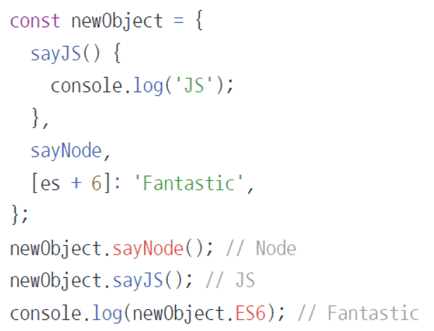
  - 객체의 메서드에: function을 붙이지 않아도 됨
  - [변수 + 값] 등으로 동적 속성명을 객체 속성명으로 사용 가능
  - { sayNode: sayNode }와 같은 것을 { sayNode }로 축약 가능

- 화살표 함수
  - 밑의 add1~4는 다 같은 기능을 함
  - 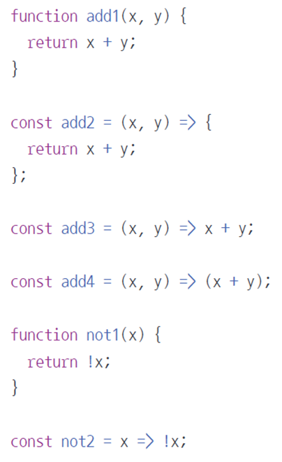
  - 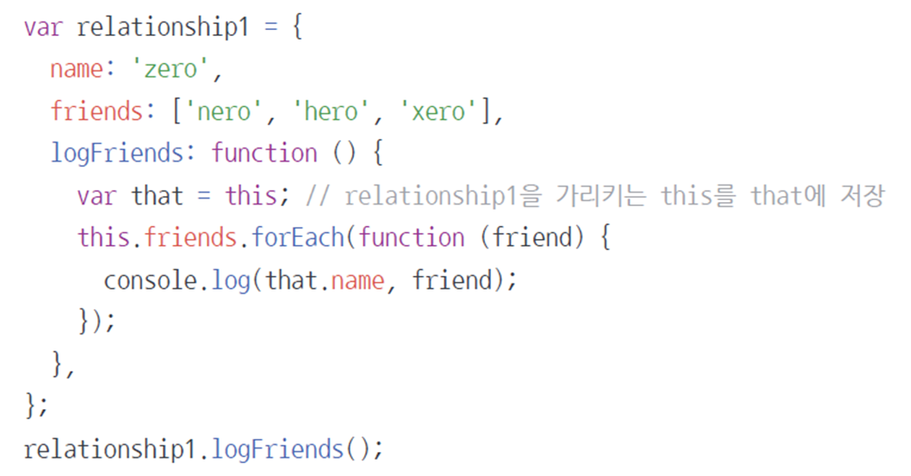
  - 화살표 함수가 기존 function() {}을 대체하는 건 아님(this가 달라짐)
    - logFriends의 메서드의 this 값에 주목
    - forEach의 function의 this와 logFriends의 this는 다름
    - that이라는 중간 변수를 이용해서 logFriends의 this를 전달
  - 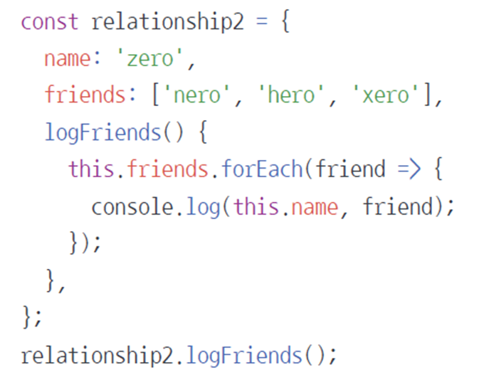
  - forEach의 인자로 화살표 함수가 들어간 것에 주목
    - forEach의 화살표 함수의 this와 logFriends의 this가 같아짐
    - 화살표 함수는 자신을 포함하는 함수의 this를 물려받음
    - 물려받고 싶지 않을 때: function() {}를 사용
  - this를 꼭 써야하는 상황에서는 function() {}을 사용하고, 나머지는 왠만하면 화살표함수를 쓰자

### **구조분해 할당**

- 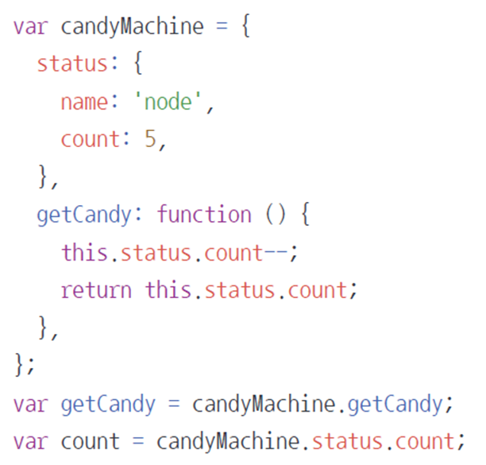
- var getCandy와 var count에 주목
  - candyMachine부터 시작해서 속성을 찾아 들어가야 함
- 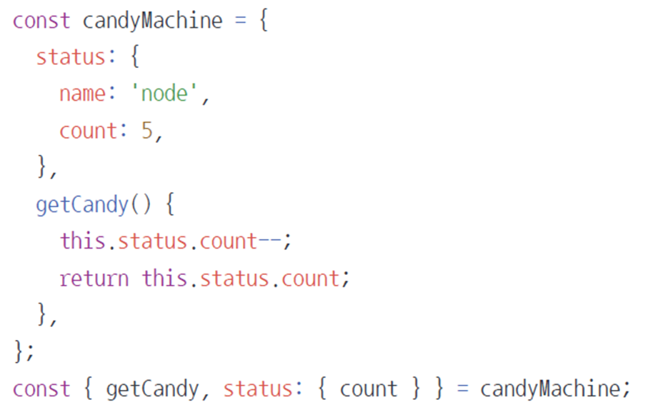
- const { 변수 } = 객체; 로 객체 안의 속성을 변수명으로 사용 가능
  - 단, getCandy()를 실행했을 때 결과가 candyMachine.getCandy()와는 달라지므로 주의
  - 그래서 this가 있는 경우 구조 분해 할당 안 하는 게 좋음
- count처럼 속성 안의 속성도 변수명으로 사용 가능
- 배열도 구조분해 할당 가능
  - 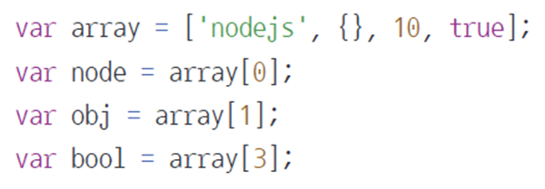
  - 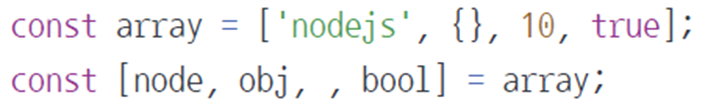

### **클래스**

- 프로토타입 문법을 깔끔하게 작성할 수 있는 Class 문법 도입
  - Constructor(생성자), Extends(상속) 등을 깔끔하게 처리할 수 있음
  - 코드가 그룹화되어 가독성이 향상됨
  - 과거
    - 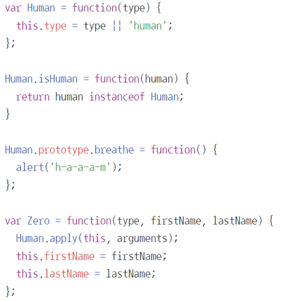
    - 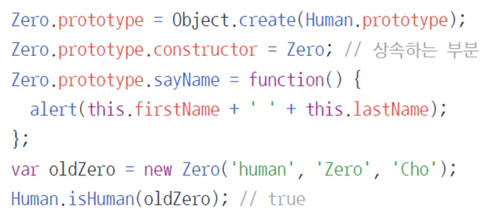
  - 클래스로 바뀐 후
    - Class 내부에 관련된 코드들이 묶임
    - Super로 부모 Class 호출
    - Static 키워드로 클래스 메서드 생성
    - 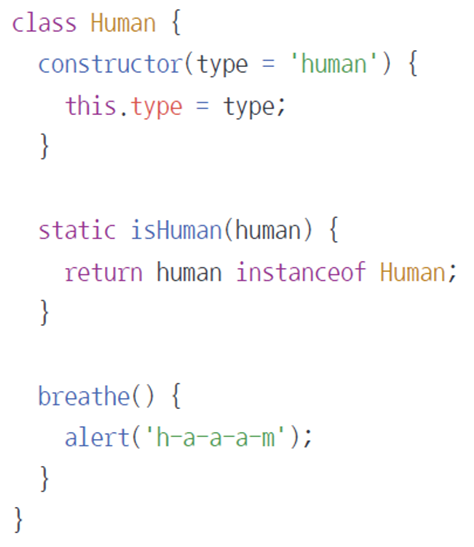
    - 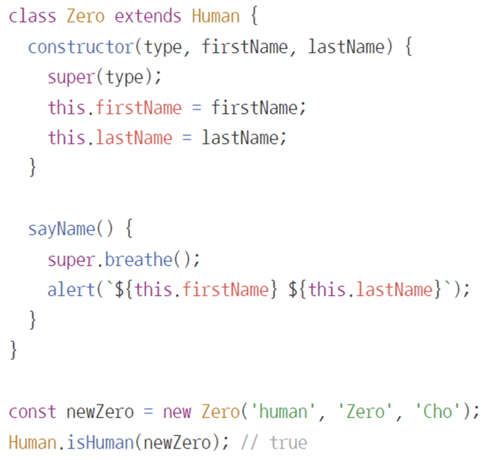

### 프로미스

- 콜백 헬이라고 불리는 지저분한 자바스크립트 코드의 해결책

  - 프로미스 : 내용이 실행은 되었지만 결과를 아직 반환하지 않은 객체
  - Then을 붙이면 결과를 반환함
  - 실행이 완료되지 않았으면 완료된 후에 Then 내부 함수가 실행됨

  - Resolve(성공 리턴값) -> then으로 연결
  - Reject(실패 리턴값) -> catch로 연결
  - Finally 부분은 무조건 실행됨
  - 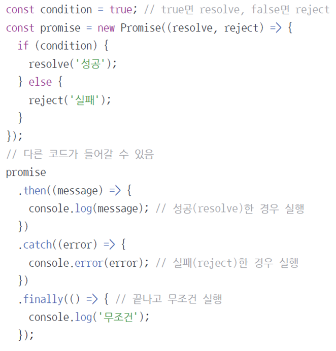

- 프로미스의 then 연달아 사용 가능(프로미스 체이닝)

  - then 안에서 return한 값이 다음 then으로 넘어감
  - return 값이 프로미스면 resolve 후 넘어감
  - 에러가 난 경우 바로 catch로 이동
  - 에러는 catch에서 한 번에 처리

  - 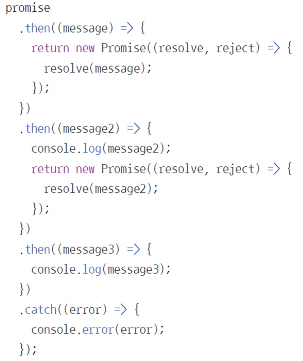

- 콜백 패턴(3중첩)을 프로미스로 바꾸는 예시

  - 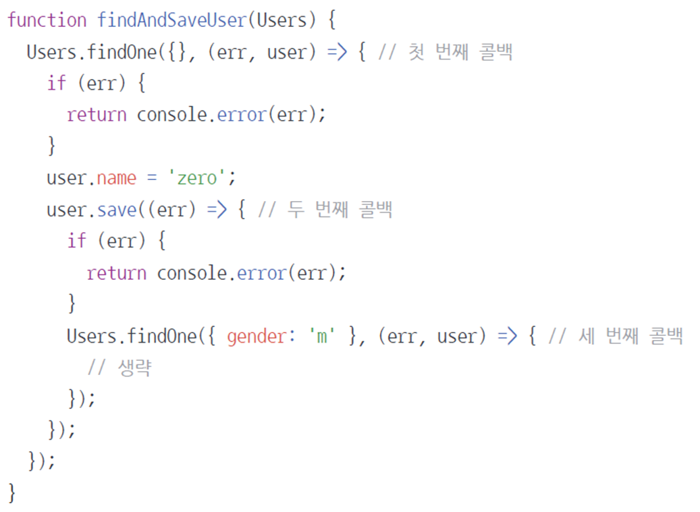
  - findOne, save 메서드가 프로미스를 지원한다고 가정
  - 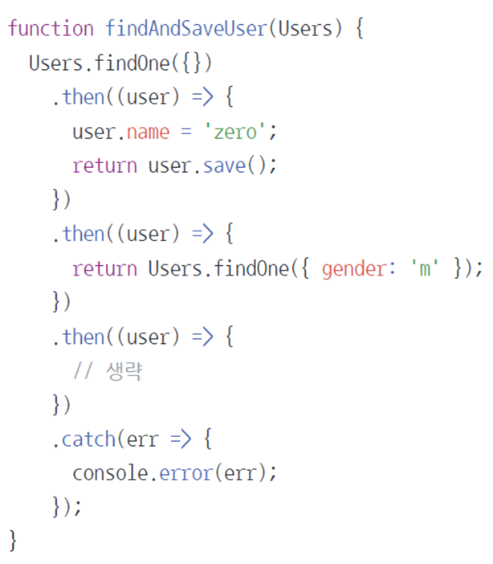

- Promise.resolve(성공리턴값): 바로 resolve하는 프로미스

- Promise.reject(실패리턴값): 바로 reject하는 프로미스

  - 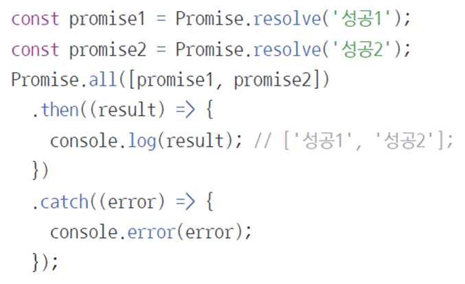

- Promise.all(배열): 여러 개의 프로미스를 동시에 실행

  - 하나라도 실패하면 catch로 감
  - allSettled로 실패한 것만 추려낼 수 있음

### async/await

- 이전의 프로미스 패턴 코드
- async/await로 한 번 더 축약 가능
- 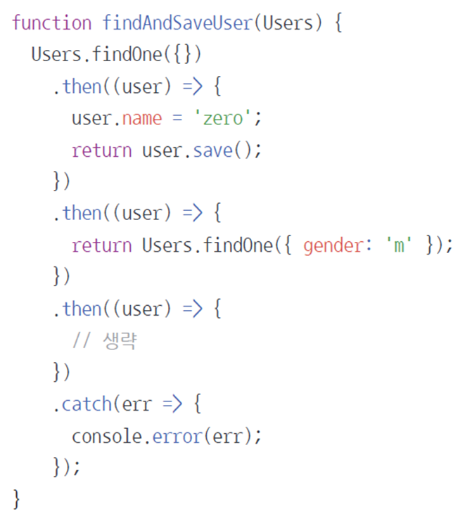
- async function의 도입
  - `변수 = await 프로미스;`인 경우 프로미스가 resolve된 값이 변수에 저장
  - `변수 await 값;`인 경우 그 값이 변수에 저장
  - 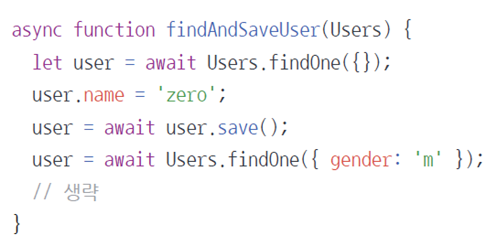
- 에러 처리를 위해 try catch로 감싸주어야 함
  - 각각의 프로미스 에러 처리를 위해서는 각각을 try catch로 감싸주어야 함
  - 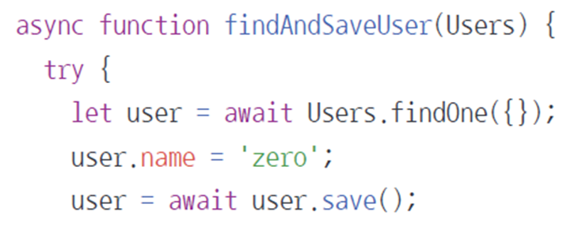
  - 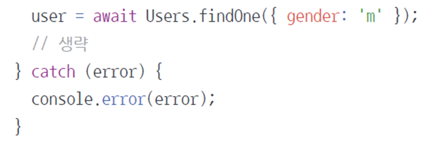
- 화살표 함수도 async/await 가능
  - 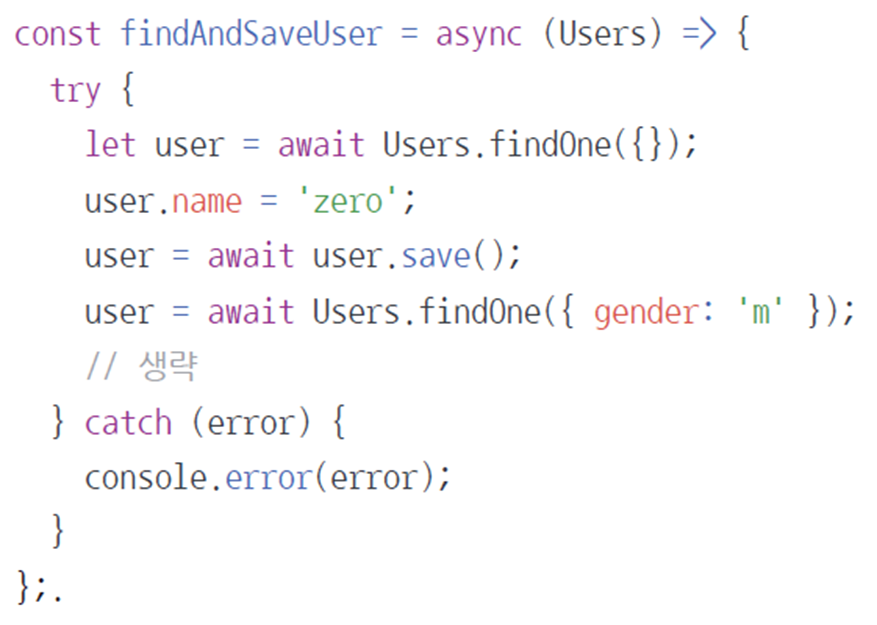
- Async 함수는 항상 promise를 반환(return)
  - Then이나 await을 붙일 수 있음
  - 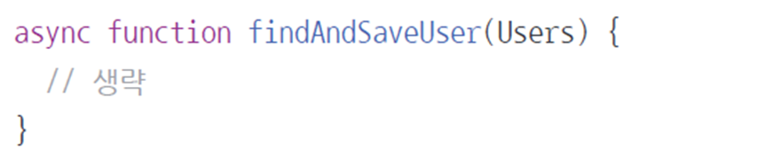
  - 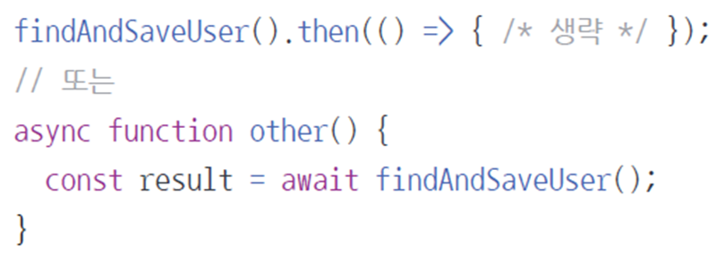
- **for await of**
  - 노드 10부터 지원
  - for await (변수 of 프로미스배열)
    - resolve된 프로미스가 변수에 담겨 나옴
    - await을 사용하기 때문에 async 함수 안에서 해야함
      - 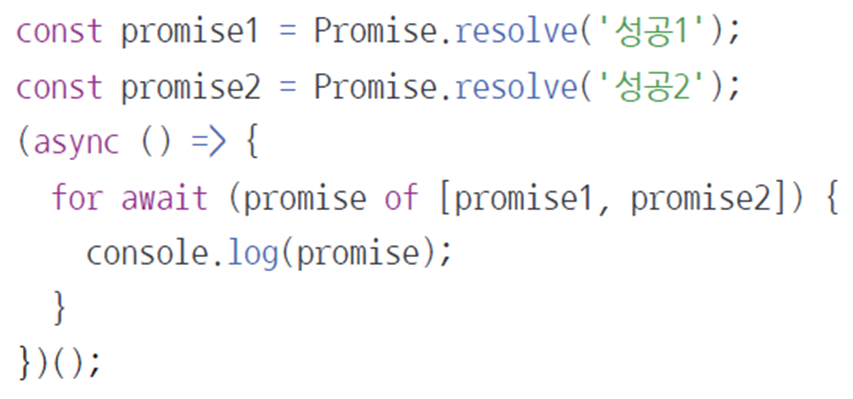

## 2.3 프론트엔트 자바스크립트

### AJAX

- 서버로 요청을 보내는 코드
  - 라이브러리 없이는 브라우저가 지원하는 XMLHttpRequest 객체 이용
  - **AJAX 요청 시 Axios 라이브러리를 사용하는 게 편함.**
  - HTML에 아래 스크립트를 추가하면 사용할 수 있음
  - 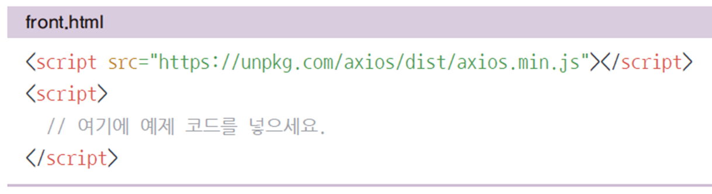
- GET 요청 보내기
  - axios.get 함수의 인수로 요청을 보낼 주소를 넣으면 됨
  - 프로미스 기반 코드라 async/await 사용 가능
  - 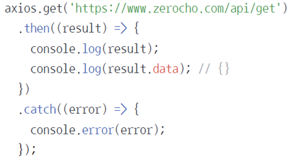
  - 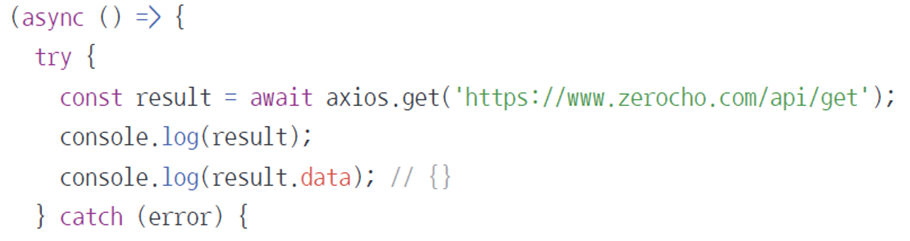

- POST 요청을 하는 코드(데이터를 담아 서버로 보내는 경우)
  - 전체적인 구조는 비슷하자 두 번째 인수로 데이터를 넣어 보냄
  - 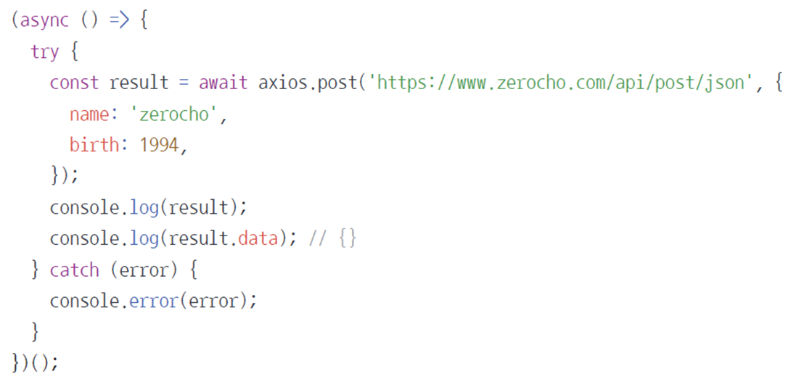
- FormData
  - HTML form 태그에 담긴 데이터를 AJAX 요청으로 보내고 싶은 경우
    - FormData 객체 이용
  - FormData 메서드
    - Append로 데이터를 하나씩 추가
    - Has로 데이터 존재 여부 확인
    - Get으로 데이터 조회
    - getAll로 데이터 모두 조회
    - delete로 데이터 삭제
    - set으로 데이터 수정
  - 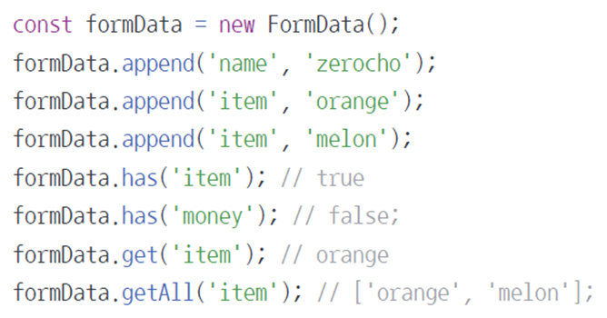
  - 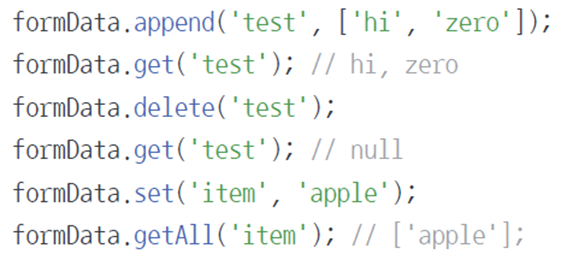
- FormData POST 요청으로 보내기
  - Axios의 data 자리에 formData를 넣어서 보내면 됨
- encodeURIComponent, decodeURIComponent
  - 가끔 주소창에 한글 입력하면 서버가 처리하지 못하는 경우 발생
  - encodeURIComponent로 한글 감싸줘서 처리
  - 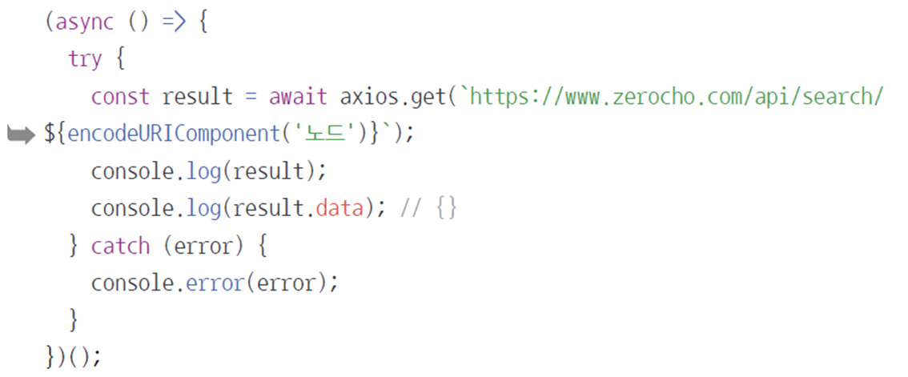
  - decodeURIComponent로 서버에서 한글 해석
    - 
- data attribute와 dataset
  - HTML 태그에 데이터를 저장하는 방법
    - 서버의 데이터를 프론트엔드로 내려줄 때 사용
    - 태그 속성으로 data-속성명
    - 자바스크립트에서 태그.dataset.속성명으로 접근 가능
      - data-user-job -> dataset.userJob
      - data-id -> dataset.id
    - 반대로 자바스크립트 dataset에 값을 넣으면 data-속성이 생김
      - dataset.monthSalary = 10000 -> data-month-salary="10000"
      - 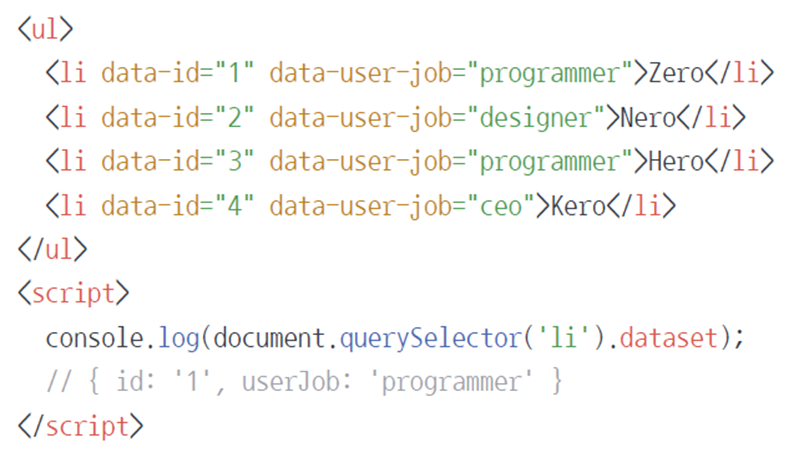