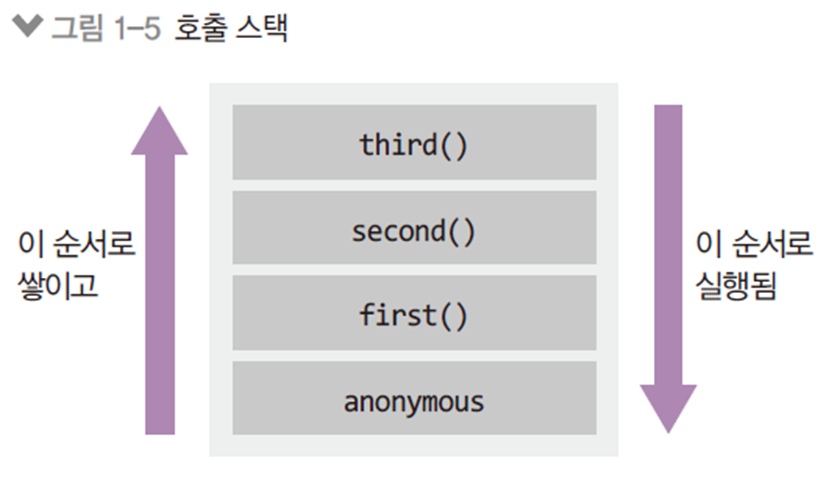
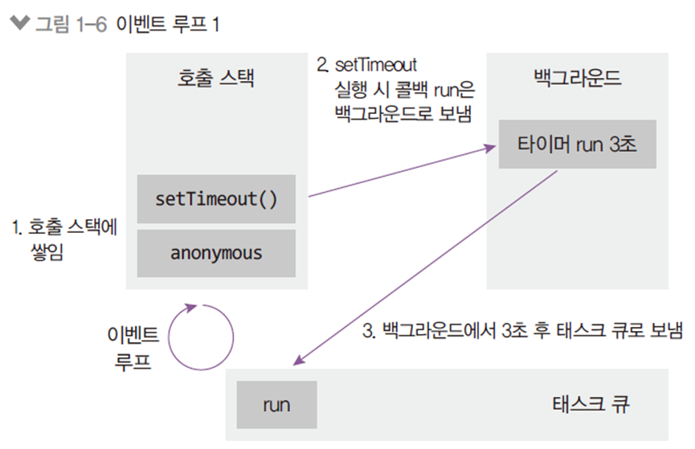

# 2

### 2.1 호출 스택, 이벤트 루프

```javascript
function first() {
    second();
    console.log('첫 번째');
}

function second() {
    third();
    console.log('두 번째');
}

function third() {
    console.log('세 번째')
}
first();
```

- 3 -> 2 -> 1
- 쉽게 파악하는 방법: 호출 스택 그리기

- 
- 호출 스택(함수의 호출, 자료구조의 스택)
  - Anonymous은 가상의 전역 컨텍스트(항상 있다고 생각하는 게 좋음)
  - 함수 호출 순서대로 쌓이고, 역순으로 실행됨
  - 함수 실행이 완료되면 스택에서 빠짐
  - LIFO 구조라서 스택이라고 불림

```javascript
function run() {
    console.log('3초 후 실행');
}
console.log('시작')
setTimeout(run, 3000);
console.log('끝');
```

- 시작 -> 끝 -> 3초 후 실행
- 호출 스택만으로는 설명이 안 됨(run은 호출 안됐는데?)
- 호출 스택 + 이벤트 루프로 설명할 수 있음



- 이벤트루프 구조
  - 이벤트 루프: 이벤트 발생(setTimeout 등) 시 호출할 콜백 함수들(위의 예제에서는 run)을 관리하고, 호출할 순서를 결정하는 역할
  - 태스크 큐 : 이벤트 발생 후 호출되어야 할 콜백 함수들이 순서대로 기다리는 공간
  - 백그라운드 : 타이머나 I/O 작업 콜백, 이벤트 리스너들이 대기하는 공간, 여러 작업이 동시에 실행될 수 있음