## 3. 노드 기능

#### 3-1. 자바스크립트는 스크립트 언어라서 즉석에서 코드를 실행할 수 있음

- REPL이라는 콘솔 제공
- R(Read), E(Evaluate), P(Print), L(Loop)
- 윈도에서는 명령 프롬프트, 맥이나 리눅스에서는 터미널에 node 입력
- 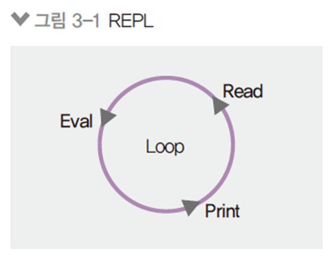

#### 3.3 모듈로 만들기

- 노드는 자바스크립트 코드를 모듈로 만들 수 있음
  - 모듈 : 특정한 기능을 하는 함수나 변수들의 집합
  - 모듈로 만들면 여러 프로그램에서 재사용 가능
  - 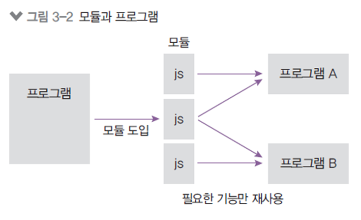
- **ES2015 모듈**
  - 자바스크립트 자체 모듈 시스템 문법이 생김
    - 아직 노드에서의 지원은 완벽하지 않음. mjs 확장자를 사용해야함
    - 크게는 require 대신 import, module.exports 대신 export default를 쓰는 것으로 바뀜

#### 3.4 노드 내장 객체 알아보기

- **global**

  - 노드의 전역 객체
    - 브라우저의 window 같은 역할
    - 모든 파일에서 접근 가능
    - window처럼 생략도 가능(console, require도 global의 속성)
    - 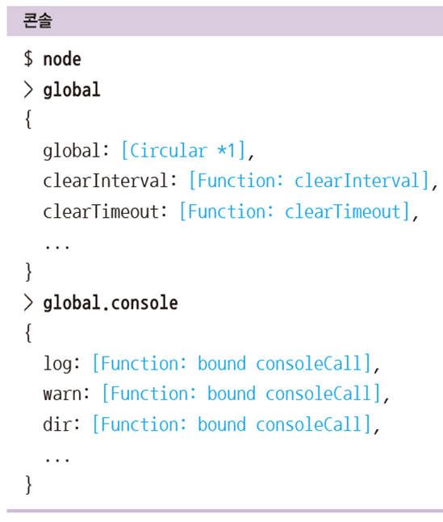

- **global 속성 공유**

  - global 속성에 값을 대입하면 다른 파일에서도 사용 가능
  - 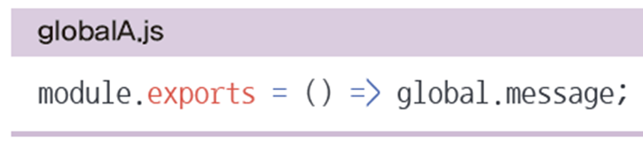
  - 권장하지 않는 방법임
  - 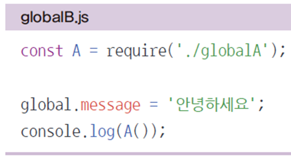
  - 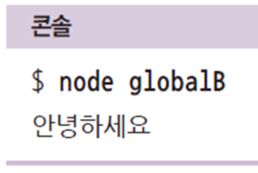

- **console 객체**

  - 브라우저의 console 객체와 매우 유사
  - console.time, console.timeEnd: 시간 로깅
  - console.error: 에러 로깅
  - console.log: 평범한 로그
  - console.dir: 객체 로깅
  - console.trace: 호출스택 로깅
  - 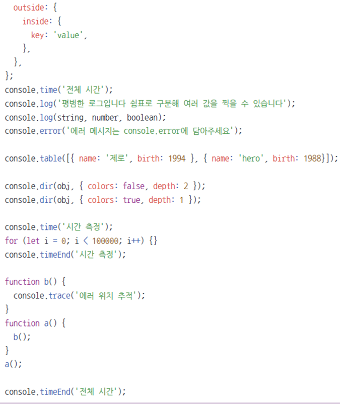
  - console.table
    - 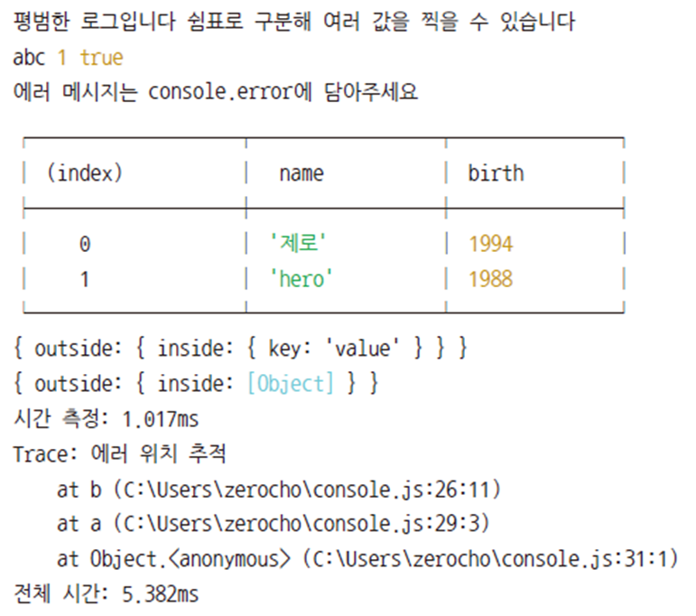

- **타이머 메서드**

  - set 메서드에 clear 메서드가 대응됨
    - set 메서드의 리턴 값(아이디)을 clear 메서드에 넣어 취소
    - setTimeout(콜백 함수, ms): 주어진 ms 이후에 콜백 함수를 실행함
    - setInterval(콜백 함수, ms): 주어진 ms초마다 콜백 함수를 반복 실행함
    - setImmediate(콜백함수): 콜백 함수 즉시 실행
    - clearTimeout(아이디): setTimeout을 취소
    - clearInterval(아이디): setInterval 취소
    - clearImmediate(아이디): setImmediate 취소
  - **setTimeout(콜백, 0)보다 setImmediate 권장**
    - 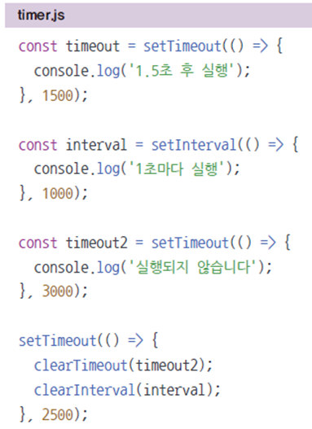
    - 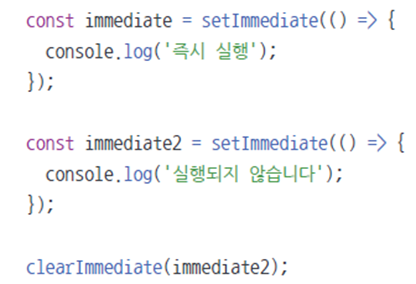

- `__filename`, `___dirname`

  - __filename: 현재 파일 경로
  - ___dirname: 현재 폴더(디렉터리) 경로
  - 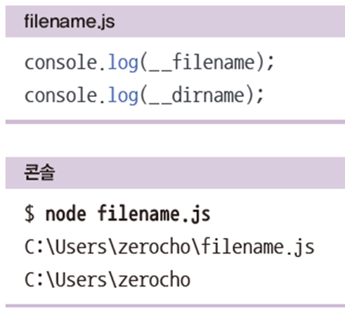

- **module, exports**

  - module.exports 외에도 exports로 모듈을 만들 수 있음

    - 모듈 예제의 var.js를 다음과 같이 바꾼 후 실행
    - 동일하게 동작함
    - 동일한 이유는 module.exports와 exports가 참조 관계이기 때문
    - exports에 객체의 속성이 아닌 다른 값을 대입하면 참조 관계가 깨짐
    - 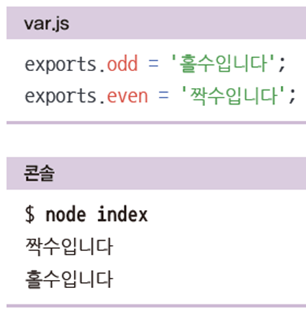
    - 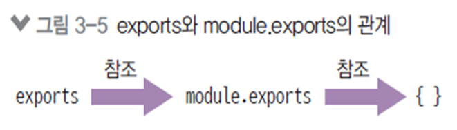

    -  moduel.exports === exports === {}(초기값)

- **this**

  - 노드에서 this를 사용할 때 주의점이 있음
    - **최상위 스코프의 this는 module.exports를 가리킴**
    - 그 외에는 브라우저의 자바스크립트와 동일
    - **함수 선언문 내부의 this는 global(전역) 객체를 가리킴**
    - 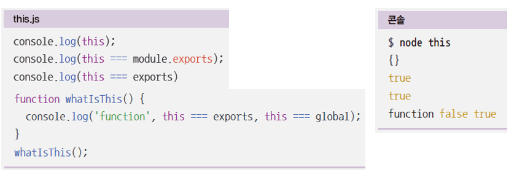

- **require의 특성**

  - 몇 가지 알아둘 만한 속성이 있음
    - require가 제일 위에 올 필요는 없음
    - require.cache에 한 번 require한 모듈에 대한 캐슁 정보가 들어있음
    - require.main은 노드 실행 시 첫 모듈을 가리킴
    - 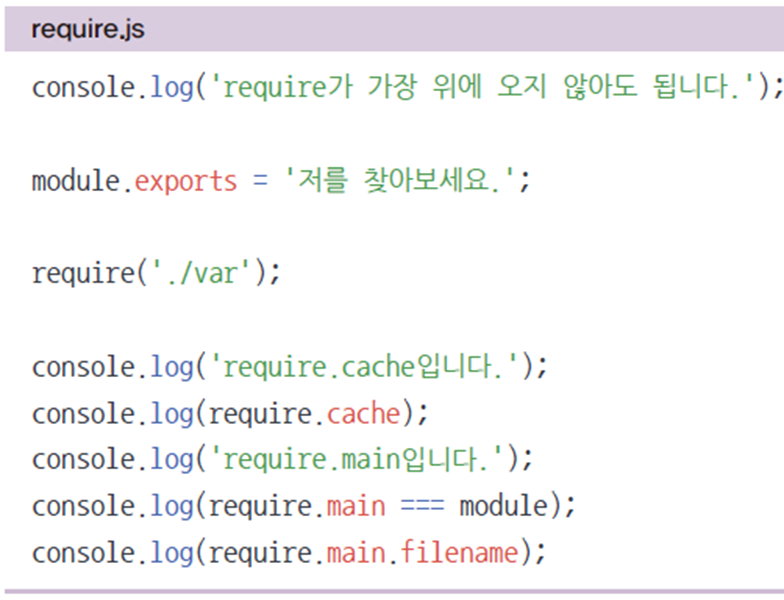

- **순환참조**
  - 두 개의 모듈이 서로를 require하는 상황을 조심해야함
    - Dep1이 dep2를 require하고, dep2가 dep1을 require 함
    - Dep1의 module.exports가 함수가 아니라 빈 객체가 됨(무한 반복을 막기 위해 의도됨)
    - **순환참조하는 상황이 나오지 않도록 하는 게 좋음.**
    - 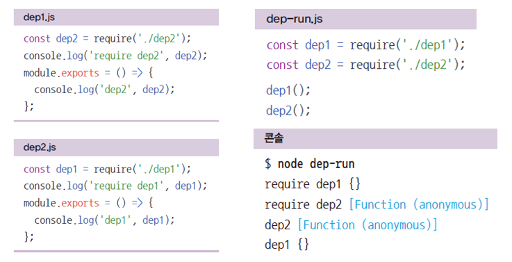

